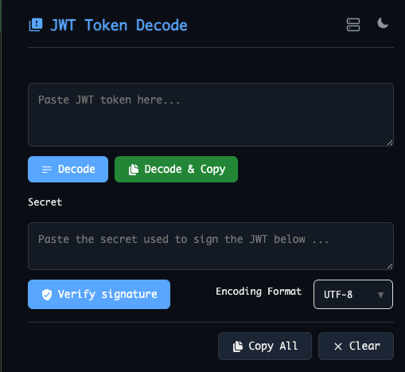
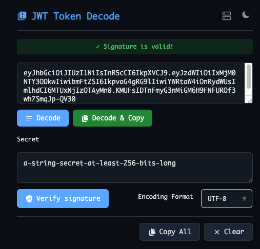
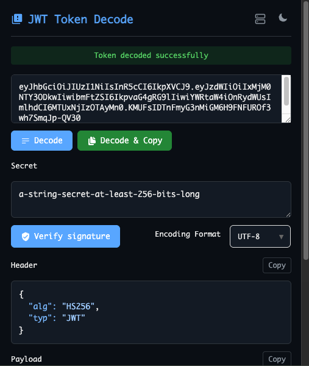
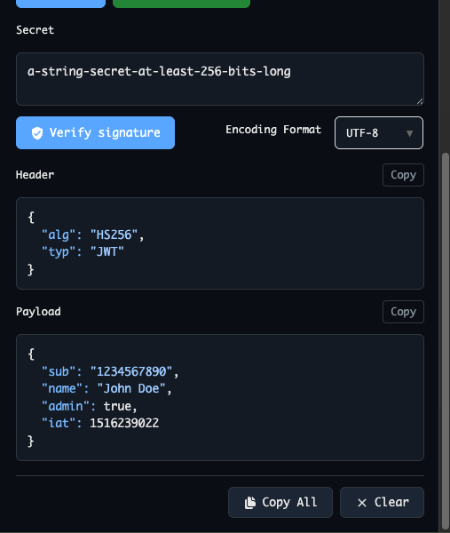
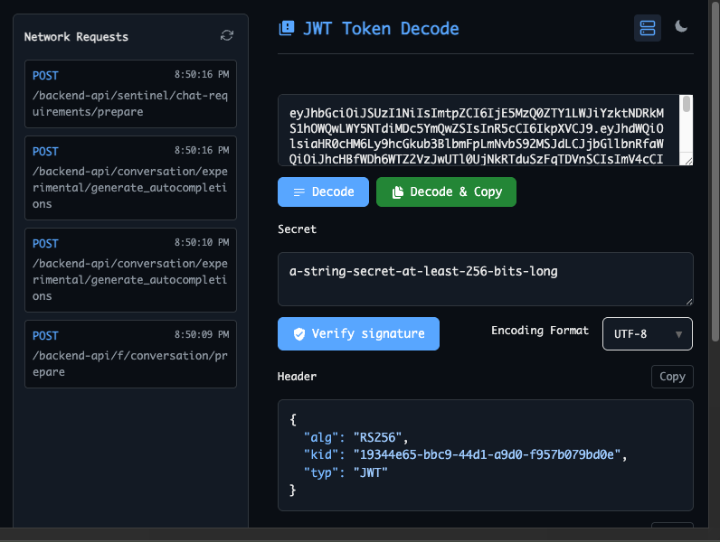
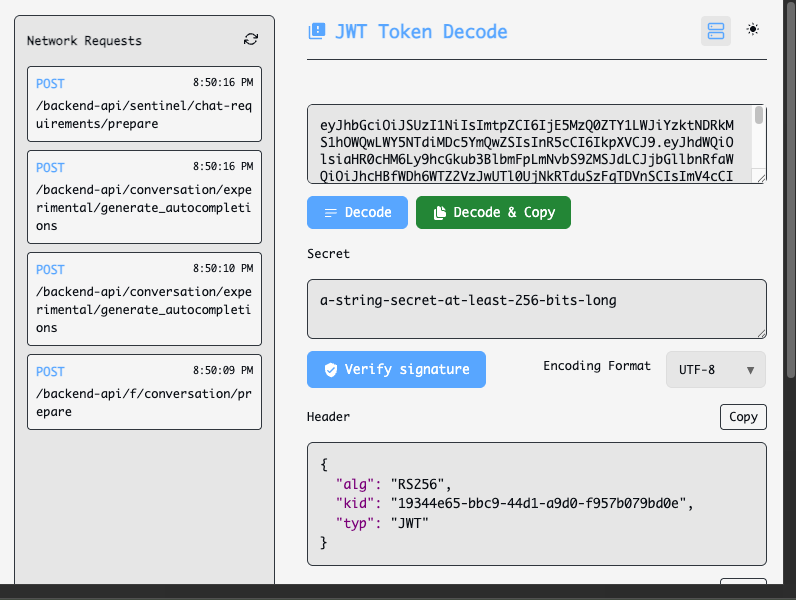

# JWT Token Decode - Chrome Extension

## Overview
JWT Token Decode is a powerful Chrome extension designed for developers to easily inspect and decode JSON Web Tokens (JWT) directly within the browser. The extension automatically captures JWT tokens from network requests and provides tools for manual decoding and signature verification.

## Features

### 🔍 Automatic JWT Detection
- Automatically scans network requests in Chrome DevTools
- Detects JWT tokens in HTTP headers
- Displays captured tokens in a convenient dropdown table
- Automatically decodes JWT payload and header information

### 🛠️ Manual JWT Processing
- Paste any JWT token for instant decoding
- Clear visualization of JWT header, payload, and signature sections
- Formatted JSON output for easy readability
- Support for all standard JWT algorithms

### 🔐 Signature Verification
- Verify JWT signatures using secret keys
- Support for HMAC algorithms (HS256, HS384, HS512)
- Validate token integrity and authenticity
- Secure client-side verification

## Installation

### From Chrome Web Store
1. Visit the Chrome Web Store
2. Search for "JWT Token Decode"
3. Click "Add to Chrome"

### Manual Installation (Developer Mode)
1. Download or clone the extension files
2. Open Chrome and navigate to `chrome://extensions/`
3. Enable "Developer mode" in the top right
4. Click "Load unpacked" and select the extension directory

## Supported JWT Formats
- Standard JWT (Header.Payload.Signature)
- All standard algorithms (HS256, HS384, HS512)
- Both encrypted and unencrypted tokens

## Privacy & Security
- All processing happens locally in your browser
- No tokens or secrets are sent to external servers
- Clean and transparent codebase

## Contributing
- Contributions are welcome! Please feel free to submit a Pull Request.

## Support
For bug reports, feature requests, or questions:
- Check existing issues
- Create a new issue with detailed information

## Acknowledgments
- Built for developers by developers
- Inspired by the need for better JWT debugging tools
- Thanks to all contributors and testers

## License
This project is licensed under the GNU General Public License v3.0.

## Screenshots

### Popup Main Interface

### Popup Main Interface With Signature Verification

### Decoded Token View

###  Popup Main Interface With Auto Network Requests With JWT View

